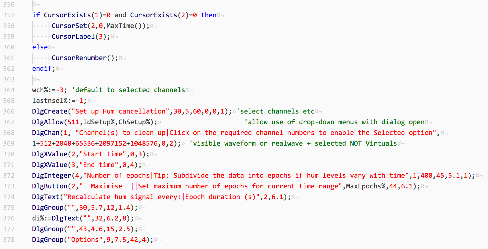

# Spike2 script language support for Atom

[Spike2](http://ced.co.uk/products/spkovin) is a recording and analysis software for electrophysiology by [Cambridge Electric Design (CED)](http://ced.co.uk/).

This package allows you to use syntax highlighting for Spike2 script language in Atom.


## GUI installation

1. Atom > Preferences… > Install pane > type`spike2` in the window and search for Packages
2. Click the blue Install button.


## Command line installation

On Termina,l type `apm install language-spike2`


## Manual installation

1. Download the folder and place it under `C:\Users\<username>\.atom\packages\` (Windows) or `/Users/<usename>/.atom/Packages/` (macOS)
2. (Re)launch Atom.


## Syntax highlighting in Spike2 style

1. Open the `styles.less` file from menu **File** > **Stylesheet...** (Windows), or **Atom** > **Stylesheet…** (macOS)
2. Add the following Less code to the file `styles.less` .The Atom editor should look like Spike2 script editor by this.

```less
// Spike2
atom-text-editor.editor {
  .syntax--source.syntax--spike2 {
    color: black;
    
    .syntax--comment {
      color: #008000;
      font-style: normal;
    }
    .syntax--string {
      color: red;
    }
    .syntax--keyword {
      color: blue;
      font-weight: normal;
    }
    .syntax--support.syntax--function {
      color: #000080;
    }
    .syntax--constant.syntax--numeric {
      color: red;
    }
  }
}
```

### Screen shot (macOS)



## Change log

+ Currently only supports syntax coloring.
+ Code folding is not supported (yet).


## Contributors

+ [Kouichi C. Nakamura, Ph.D](https://github.com/kouichi-c-nakamura)